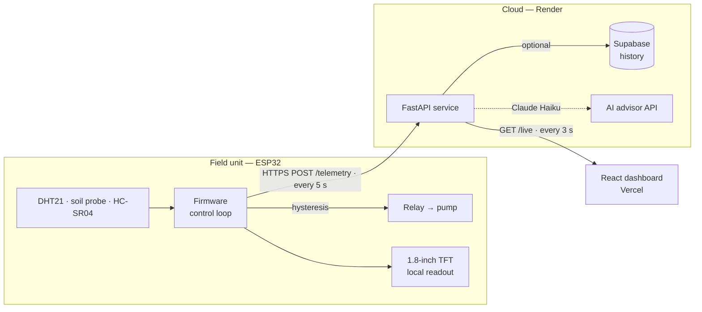

# AgroSense — Smart Irrigation System

A solar-aware, sensor-driven irrigation platform. An ESP32 in the field runs a fully autonomous watering loop, streams live telemetry to a cloud API, and a web dashboard turns that stream into readable, crop-specific insight — with an on-board agronomy advisor that works with zero configuration.

[](firmware/)
[](backend/)
[](frontend/)
[](#license)

**Live dashboard:** https://irrigation-ashen.vercel.app · **API + interactive docs:** https://agrosense-api-g4nb.onrender.com/docs

> The backend runs on a free Render instance that sleeps when idle — the first request after a quiet period takes ~50 s to wake, then it's instant.

---

## Contents

- [Overview](#overview)
- [System architecture](#system-architecture)
- [Features](#features)
- [Hardware](#hardware)
- [Repository layout](#repository-layout)
- [Tech stack](#tech-stack)
- [Quick start](#quick-start)
- [API reference](#api-reference)
- [Configuration](#configuration)
- [Deployment](#deployment)
- [Design system](#design-system)
- [License](#license)

---

## Overview

AgroSense answers a single question continuously: **should this field be watered right now?** It splits that job across three tiers, each of which is useful on its own:

- **The device decides.** Irrigation is controlled on the ESP32 by a soil-moisture hysteresis loop, so the crop is watered correctly even with no internet, no server, and no dashboard open.
- **The cloud observes.** The device posts a reading every 5 seconds to a FastAPI service, which keeps the latest state in memory for instant reads and optionally persists history to Supabase.
- **The dashboard explains.** A React app polls live state and renders it as sensor cards, trends, a reservoir gauge, and a crop-aware advisor that reasons over the readings.

Control lives at the edge; the cloud is for visibility, history, and advice. If the network drops, the pump keeps doing the right thing.

---

## System architecture



**Data flow, one direction:**

1. The ESP32 reads temperature, humidity, soil moisture, reservoir distance, pump state, and charge status.
2. It drives the pump locally (hysteresis) and POSTs the reading to `/api/v1/sensors/telemetry`.
3. The API converts the ultrasonic distance to a reservoir percentage, stores the reading in memory, and (if configured) writes it to Supabase in a background task that can never block the device.
4. The dashboard polls `/api/v1/sensors/live` every 3 seconds and shows the current state, flagging the device offline if no reading has arrived in the last 15 seconds.

The dashboard never commands the device — it is a read-only view of an autonomous system.

---

## Features

### Field unit (ESP32)

- **Autonomous pump control** with hysteresis (on at ≤60% soil moisture, off at ≥75%) to prevent relay chatter around the setpoint.
- **On-device TFT dashboard** — live temperature, humidity, soil bar, reservoir distance, pump state, and an animated charge indicator, so the rig is readable in the field with no phone.
- **Ultrasonic reservoir sensing** — a top-mounted HC-SR04 measures water level and the backend maps it to a fill percentage.
- **Resilient networking** — telemetry POSTs over HTTPS every 5 s; a failed post never affects the control loop, and Wi-Fi auto-reconnects.

### Backend (FastAPI)

- **Telemetry ingestion** with instant in-memory live state and optional Supabase history.
- **Runs with zero configuration** — every setting has a default, so the service boots and serves live data with no environment variables at all.
- **AI advisor API** (Claude Haiku) that builds a context-loaded prompt from the crop profile, live sensors, weather, and reservoir state.
- **Rule-based irrigation engine** — a deterministic decision (`now` / `soon` / `later` / `hold`) with a plain-language reason and a computed run-time, no API key required.
- **Built-in crop knowledge base** — optimal moisture bands and daily water needs for 8 crops across 4 growth stages.

### Dashboard (React)

- **Live sensor cards** with status bands, trends, and sparklines built from real readings.
- **Reservoir gauge, combined trend chart, irrigation zones, and a weather strip** with rain-aware messaging.
- **Offline agronomy advisor** — a deterministic, on-device engine that turns the live readings and the farmer's crop profile into specific guidance, with no API key and no network round-trip.
- **Guided onboarding + auth** — Supabase email/password with a one-tap demo login, and a reload-safe session.

---

## Hardware

### Bill of materials

| Component       | Part                   | Role                           |
| --------------- | ---------------------- | ------------------------------ |
| MCU             | ESP32 dev board        | Control loop, Wi-Fi, telemetry |
| Temp / humidity | DHT21 (AM2301)         | Air temperature and humidity   |
| Soil moisture   | Analog probe           | Soil moisture (ADC)            |
| Water level     | HC-SR04 ultrasonic     | Reservoir depth → fill %       |
| Display         | ST7735 1.8" TFT (SPI)  | On-device readout              |
| Actuator        | Relay module           | Switches the pump              |
| Power sense     | Divider on charge rail | Detects charging/solar         |

### Pin map

| Signal                 | ESP32 pin              | Notes                                  |
| ---------------------- | ---------------------- | -------------------------------------- |
| TFT CS / DC / RST      | GPIO5 / GPIO27 / GPIO4 | Hardware SPI (SCK GPIO18, MOSI GPIO23) |
| DHT data               | GPIO13                 | DHT21                                  |
| Soil moisture          | GPIO34                 | ADC1, input-only pin                   |
| Ultrasonic TRIG / ECHO | GPIO26 / GPIO25        | Level-shift ECHO to 3.3 V              |
| Relay (pump)           | GPIO14                 | Active HIGH                            |
| Charge sense           | GPIO32                 | ADC                                    |

### Control logic

The pump is governed by **hysteresis**, not a single threshold:

```
soil ≤ 60%  → pump ON
soil ≥ 75%  → pump OFF
60–75%      → hold current state
```

This dead-band stops the pump from rapidly switching when the reading hovers near the target. Soil percentage is mapped from the raw ADC with `SOIL_DRY = 3300` (probe in air) and `SOIL_WET = 1200` (probe in water) — recalibrate these two constants for your probe and soil.

### Reservoir sensing

The ultrasonic sensor sits at the top of the tank facing down, so a **small distance means a full tank**. The backend converts distance to a percentage against a configured tank height (default 30 cm):

```
reservoir_% = (tank_height − distance) / tank_height × 100   (clamped 0–100)
```

Set the tank height in [`backend/app/store.py`](backend/app/store.py) to match your reservoir.

Full wiring and flashing instructions live in [`firmware/README.md`](firmware/README.md).

---

## Repository layout

```
.
├── firmware/
│   └── agrosense_firmware.ino     ESP32 sketch — sensors, pump control, TFT, telemetry
├── backend/                       FastAPI service (Python 3.12)
│   ├── app/
│   │   ├── routes/
│   │   │   ├── sensors.py          telemetry · live · history · status
│   │   │   └── ai.py               chat · recommend-irrigation
│   │   ├── ai.py                   crop knowledge base, prompt builder, rule engine
│   │   ├── config.py               settings (env-driven, all optional)
│   │   ├── db.py                   Supabase persistence (optional, non-blocking)
│   │   ├── models.py               Pydantic request/response models
│   │   └── store.py                in-memory live state + reservoir math
│   ├── main.py                     app entry, CORS, router mounting
│   ├── requirements.txt
│   ├── .env.example
│   └── .python-version             pins 3.12.7 for the Render build
├── frontend/                      React + TypeScript + Vite dashboard
│   └── src/
│       ├── components/             SensorCard, Reservoir3D, CombinedChart, WeatherStrip, …
│       ├── pages/                  Landing, Login, Onboarding, Dashboard, Sensors, Irrigation, Weather, AIAdvisor
│       ├── hooks/                  useLiveData (polls /live), useIsMobile
│       ├── lib/                    auth (Supabase), advisor (offline AI), farm (crop profile + KB)
│       ├── data/config.ts          display config + shared thresholds
│       └── types/                  shared interfaces
├── docs/
│   └── DEPLOYMENT.md              Render + Vercel + device deployment guide
├── render.yaml                    Render blueprint
└── README.md
```

---

## Tech stack

| Tier     | Technologies                                                                             |
| -------- | ---------------------------------------------------------------------------------------- |
| Firmware | ESP32, Arduino C++, Adafruit GFX/ST7735, ArduinoJson, `WiFiClientSecure`                 |
| Backend  | FastAPI, Uvicorn, Pydantic v2, Anthropic SDK (Claude Haiku), httpx, Supabase (PostgREST) |
| Frontend | React 18, TypeScript, Vite 5, Recharts, Lucide, date-fns, Supabase JS                    |
| Hosting  | Render (API), Vercel (dashboard), Supabase (optional history)                            |

---

## Quick start

**Prerequisites:** Python 3.12, Node.js 18+, and the Arduino IDE (or `arduino-cli`) with the ESP32 board package.

Clone the repository:

```bash
git clone https://github.com/Opeyemi-Builds/irrigation.git
cd irrigation
```

### 1 — Backend

```bash
cd backend
python -m venv venv
source venv/bin/activate            # Windows: venv\Scripts\activate
pip install -r requirements.txt
uvicorn main:app --reload           # http://localhost:8000  (docs at /docs)
```

No `.env` is required — the service runs on in-memory data out of the box. Copy `.env.example` to `.env` only to enable the Claude advisor, real weather, or Supabase history.

### 2 — Frontend

```bash
cd frontend
npm install
echo "VITE_API_BASE_URL=http://localhost:8000" > .env.local
npm run dev                         # http://localhost:5173
```

`VITE_API_BASE_URL` is read at build time — restart the dev server after changing it. Use the demo login (`demo@agrosense.app` / `agrosense`) to skip account creation.

### 3 — Firmware

Open [`firmware/agrosense_firmware.ino`](firmware/agrosense_firmware.ino), set your Wi-Fi credentials and point `api_url` at your backend's telemetry endpoint:

```cpp
const char* ssid     = "YOUR_WIFI_SSID";
const char* password = "YOUR_WIFI_PASSWORD";
const char* api_url  = "https://<your-backend>/api/v1/sensors/telemetry";
```

Flash to the ESP32. It connects to Wi-Fi and begins posting within a few seconds; watch the Serial Monitor at 115200 baud for `POST 200`.

---

## API reference

Base path: `/api/v1`. Full interactive documentation is served at `/docs`.

| Method | Endpoint                          | Purpose                                         |
| ------ | --------------------------------- | ----------------------------------------------- |
| `GET`  | `/health`                         | Liveness probe → `{"status":"ok"}`              |
| `POST` | `/api/v1/sensors/telemetry`       | Ingest one device reading                       |
| `GET`  | `/api/v1/sensors/live`            | Latest reading + connection status              |
| `GET`  | `/api/v1/sensors/history?hours=N` | History from Supabase (1–168 h)                 |
| `GET`  | `/api/v1/sensors/status`          | Lightweight connection check                    |
| `POST` | `/api/v1/ai/chat`                 | Claude advisor chat (needs `ANTHROPIC_API_KEY`) |
| `POST` | `/api/v1/ai/recommend-irrigation` | Rule-based decision (no key needed)             |

**Telemetry payload** (posted by the device):

```json
{
  "temperature": 28.5,
  "humidity": 65.0,
  "soil_moisture": 42.0,
  "el_cm": 12.0,
  "pump_status": true,
  "is_charging": false
}
```

Endpoint-by-endpoint detail, request/response schemas, and the AI prompt design are in [`backend/README.md`](backend/README.md).

---

## Configuration

All backend settings are optional — the service runs fully without them, degrading only the corresponding feature.

| Variable                                | Default                 | Effect when unset                                                           |
| --------------------------------------- | ----------------------- | --------------------------------------------------------------------------- |
| `ANTHROPIC_API_KEY`                     | `""`                    | `/ai/chat` returns 401; the rule engine and dashboard advisor still work    |
| `OPENWEATHER_API_KEY`                   | `""`                    | Reserved for live weather (current build uses representative forecast data) |
| `FARM_LAT` / `FARM_LON`                 | `7.3775` / `3.9470`     | Farm location (Ibadan, NG)                                                  |
| `FRONTEND_URL`                          | `http://localhost:5173` | CORS origin hint (CORS is open by default)                                  |
| `SUPABASE_URL` / `SUPABASE_SERVICE_KEY` | `""`                    | No history persistence; live data is in-memory only                         |

The Supabase **service-role key is secret and lives only in the backend** — it is never shipped to the browser or committed. The frontend needs only `VITE_API_BASE_URL`.

---

## Deployment

The system runs on free tiers end to end — Render for the API, Vercel for the dashboard, and the device pointed at the Render URL over HTTPS. The full walkthrough, including the Render Python pin and the Vercel build-time environment variable, is in **[`docs/DEPLOYMENT.md`](docs/DEPLOYMENT.md)**.

| Component | Platform         | Notes                                                      |
| --------- | ---------------- | ---------------------------------------------------------- |
| Backend   | Render           | Blueprint in `render.yaml`; Python pinned to 3.12.7        |
| Frontend  | Vercel           | Set `VITE_API_BASE_URL` in project settings, then redeploy |
| Device    | On-network ESP32 | `api_url` → `<render-url>/api/v1/sensors/telemetry`        |

---

## Design system

The dashboard uses a dark, green-tinted agricultural theme defined as CSS custom properties in [`frontend/src/index.css`](frontend/src/index.css), so a re-theme is a single-file edit.

| Token                          | Value                             | Use                           |
| ------------------------------ | --------------------------------- | ----------------------------- |
| `--bg-base`                    | `#0a0f0d`                         | App background                |
| `--accent-primary`             | `#5dea8a`                         | Primary green / optimal state |
| `--amber` / `--red` / `--blue` | `#f5a623` / `#ff5e5e` / `#5bbfef` | Warning / critical / info     |
| `--font-display`               | Syne                              | Headings and numerics         |
| `--font-body`                  | DM Sans                           | Body and UI labels            |

---

## License

Released under the MIT License. Add a `LICENSE` file to make the grant explicit for redistribution.

---

Built by [@Opeyemi-Builds](https://github.com/Opeyemi-Builds).
